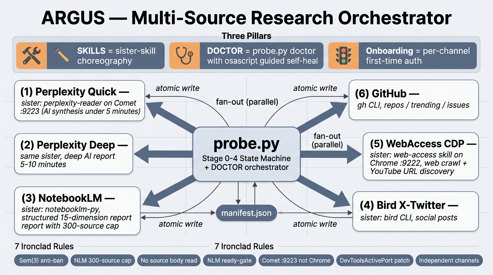

# Argus

> Multi-source deep research orchestrator. SKILLS-style sister-skill choreography, with built-in DOCTOR auto-detection and guided Onboarding.

[](https://opensource.org/licenses/Apache-2.0)
[](https://github.com/argus-research/argus/actions/workflows/ci.yml)

[Read in Chinese](./README.zh-CN.md)



---

## What Argus Is — Three Pillars

Argus combines three orthogonal capabilities into one CLI:

### 1. SKILLS — Sister-Skill Orchestration

Argus does not implement search or scrape itself. It coordinates **6 independent channels** — Perplexity, NotebookLM, X/Twitter via Bird, web crawl via web-access, Chrome reader, and GitHub — into one OODC-Observe pipeline. Each channel is a separate "sister skill" that you supply (`perplexity-reader`, `notebooklm-py`, `bird`, `web-access`, ...). Argus manages rate limits, quotas, and failure isolation; channels do not know about each other.

### 2. DOCTOR — Auto-Detect & Self-Heal

First-time setup across 6 channels is non-trivial. `probe.py doctor` checks every channel, tells you exactly what is broken, and on macOS pops `osascript` dialogs with the precise remediation command. Two modes: `--essential <list>` for a quick gate before a research run, plain `doctor` for full guided onboarding.

### 3. Onboarding — Guided First-Time Auth

Each channel has a per-channel walkthrough (see below). Run `doctor`, follow popup prompts, and you will be running multi-source research in roughly 10 minutes — assuming Chrome or Comet and NotebookLM accounts exist.

---

## DOCTOR — Auto-Detect & Self-Heal

`probe.py doctor` is the entry point for any first-time or broken-channel situation. It has two modes.

### Mode 1: Essential-only check (fast gate)

Use this as a pre-research gate in scripts, CI, or cron jobs. It exits immediately if any listed channel is not ready.

```bash
python3 scripts/probe.py doctor \
  --essential comet-9223,perplexity-auth,chrome-9222,notebooklm-auth \
  --no-popup
```

Returns exit code `0` only if all listed channels are ready. Useful before kicking off a long research session.

### Mode 2: Full guided check (interactive)

Runs all 6 channels (`comet-9223`, `perplexity-auth`, `chrome-9222`, `webaccess-proxy`, `notebooklm-auth`, `bird-auth`). On macOS, failed channels trigger an `osascript` dialog with the exact remediation.

```bash
python3 scripts/probe.py doctor
```

In the dialog, you can:
- Click **OK** to launch the suggested auto-fix (e.g., opens `perplexity-login.py`)
- Click **Cancel** to skip that channel and continue
- Re-run `doctor` after fixing to confirm the channel is now green

Add `--no-popup` to force text-only output (useful in remote or headless environments). Add `--json` for machine-readable output.

### Exit Codes

| Code | Meaning |
|------|---------|
| 0 | All channels ready |
| 2 | Some non-essential channels failed (research continues with those skipped) |
| 3 | At least one essential channel failed (research blocked) |
| 4 | Quota exceeded (e.g., Perplexity Deep daily cap reached) |

---

## Onboarding — First-Time Auth Walkthrough

Each channel needs to be authorized once. Follow these steps in order. After completing all of them, run `probe.py doctor` to confirm everything is green.

### 1. Comet Browser on port 9223 (required for Perplexity)

Comet is Perplexity's proprietary browser (free download from perplexity.ai). Without it, regular Chrome triggers hCaptcha on Perplexity pages.

```bash
# Launch Comet with remote debugging enabled
nohup /Applications/Comet.app/Contents/MacOS/Comet \
  --remote-debugging-port=9223 \
  --remote-allow-origins=* \
  >/dev/null 2>&1 &

# Verify the port is live
curl -s http://localhost:9223/json/version
```

You should see a JSON response with browser version info. Keep Comet running during research sessions.

### 2. Perplexity login cookie

Install the `perplexity-reader` sister skill (bring your own implementation, or adapt a community fork — see [CONTRIBUTING.md](./CONTRIBUTING.md)). Then run the login helper:

```bash
python3 /path/to/perplexity-reader/scripts/perplexity-login.py login
# Cookie is persisted to $PERPLEXITY_COOKIES_PATH
# Default: ~/.config/argus/cookies/perplexity.json
```

The cookie is valid until your Perplexity session expires. Re-run the login when `probe.py doctor` reports `perplexity-auth: FAIL`.

### 3. Chrome on port 9222 (required for WebAccess)

Chrome must be launched with remote debugging enabled, and the `DevToolsActivePort` file must be written correctly. A missing or stale port file is the most common cause of "connect failed" errors — it is a path issue, not a permissions issue.

```bash
# Launch Chrome with remote debugging
nohup "/Applications/Google Chrome.app/Contents/MacOS/Google Chrome" \
  --remote-debugging-port=9222 \
  --user-data-dir="$HOME/.chrome-debug-profile" \
  --remote-allow-origins=* >/dev/null 2>&1 &

# Write the DevToolsActivePort file (required by Argus)
WS_PATH=$(curl -s http://localhost:9222/json/version \
  | python3 -c "import sys,json; print(json.load(sys.stdin)['webSocketDebuggerUrl'].replace('ws://localhost:9222',''))")
printf "9222\n${WS_PATH}\n" \
  > "$HOME/Library/Application Support/Google/Chrome/DevToolsActivePort"
```

### 4. WebAccess CDP proxy

Clone and set up the `web-access` sister skill:

```bash
git clone https://github.com/eze-is/web-access ~/.local/share/web-access
bash ~/.local/share/web-access/scripts/check-deps.sh
```

The WebAccess proxy listens on `localhost:3456` by default. It wraps Chrome CDP and exposes a higher-level crawl API that Argus calls.

### 5. NotebookLM (Google OAuth)

```bash
pip install notebooklm-py
notebooklm login
# Opens a browser window for Google OAuth; complete sign-in and return to the terminal
```

After successful login, `notebooklm-py` persists your credentials locally. The login is valid until the Google session expires.

### 6. Bird CLI (X/Twitter)

Sign in to X.com in your Chrome **default** profile first (not the `--user-data-dir` debug profile), then:

```bash
# Install bird CLI (bring your own or use a community build)
npm install -g bird-cli

# Verify authentication
bird whoami
# Should print your X/Twitter handle
```

### 7. GitHub CLI

```bash
brew install gh
gh auth login
# Follow the prompts (browser or token-based auth)

# Verify
gh api user --jq .login
```

After completing all 7 steps, run a full doctor check:

```bash
python3 scripts/probe.py doctor
```

All channels should show green. Any remaining failures will include a remediation hint.

---

## 6 Channels

| Channel | Purpose | Sister Skill | First-Time Auth |
|---------|---------|--------------|-----------------|
| `perplexity_quick` | AI synthesis (3-round, under 5 min) | perplexity-reader + Comet | Steps 1 and 2 |
| `perplexity_deep` | Long-form AI research report (5–10 min) | perplexity-reader + Comet | Steps 1 and 2 |
| `nlm` | Structured multi-source report (15–45 min, up to 300 sources) | notebooklm-py | Step 5 |
| `bird` | X/Twitter post search and social signal harvesting | bird CLI | Step 6 |
| `webaccess` | Web crawl and YouTube URL discovery | web-access + Chrome CDP | Steps 3 and 4 |
| `github` | Repository search, trending, and issue discovery | gh CLI | Step 7 |

Each channel is **independently fallback-safe**: a failure in one does not block the others. Channels that fail or are skipped appear in the manifest with `status=skipped`.

---

## Quick Start

```bash
# 1. Clone
git clone <repo-url> argus
cd argus

# 2. Install Python dependencies
pip install -r requirements.txt

# 3. Set up sister skills (see Onboarding above)

# 4. Verify all channels
python3 scripts/probe.py doctor

# 5. Run a full research session
#    (15-dimension NotebookLM report, 90-minute budget)
python3 scripts/probe.py run \
  --topic "AI developer tooling competitive landscape" \
  --dimensions 15 \
  --budget 90m \
  --output ~/argus-output/
```

The output directory contains:
- `manifest.json` — per-channel status, URL list, snippet index
- `nlm_report.md` — NotebookLM structured report (if channel ran)
- `perplexity_quick.md` / `perplexity_deep.md` — Perplexity outputs
- `github_results.json` — GitHub search results
- `bird_results.json` — X/Twitter search results
- `webaccess_results.json` — Web crawl URLs and snippets

Argus supports **checkpoint and resume**: if interrupted, re-run the same command and it skips completed stages using `manifest.json`. Or resume explicitly:

```bash
python3 scripts/probe.py resume ~/argus-output/manifest.json
```

---

## CLI Reference

### probe.py

```
probe.py run    --topic TOPIC [--dimensions N] [--budget TIME] [--output PATH]
                [--skip-nlm] [--skip-deep] [--skip-gh] [--dry-run] [--resume PATH]

probe.py doctor [--essential LIST] [--skip LIST] [--strict]
                [--no-popup] [--json] [--topic TOPIC]

probe.py resume MANIFEST_PATH
```

**Common flags for `run`:**

| Flag | Default | Description |
|------|---------|-------------|
| `--topic` | required | Research topic string |
| `--dimensions` | 10 | Number of NLM report dimensions |
| `--budget` | 60m | Time budget (e.g., `30m`, `2h`) |
| `--output` | `./argus-output` | Output directory |
| `--dry-run` | off | Print plan without executing |
| `--skip-nlm` | off | Skip NotebookLM (faster, no structured report) |

**Common flags for `doctor`:**

| Flag | Description |
|------|-------------|
| `--essential LIST` | Comma-separated channels; exit 3 if any fail |
| `--no-popup` | Disable osascript dialogs (text-only output) |
| `--json` | Machine-readable JSON output |
| `--strict` | Exit non-zero if any channel fails (not just essential ones) |

### tool_auth_check.py

```
tool_auth_check.py [--essential LIST] [--skip LIST] [--strict] [--no-popup] [--json]
```

Used internally by `probe.py doctor`. Can also be invoked standalone for scripted channel checks in CI pipelines.

---

## Architecture

Argus is a Stage 0–4 state machine. It handles only the OODC-Observe step and hands off a structured manifest for human-driven Orient, Decide, and Create phases.

```
Stage 0  DOCTOR       Channel authorization preflight
Stage 1  DISCOVER     Parallel fan-out: Perplexity Quick + Bird + WebAccess + GitHub
Stage 1.5 INJECT      NotebookLM source ingestion (serial, rate-limited, 1.5s between sources)
Stage 2  DEEP         Perplexity Deep report (starts after Quick completes)
Stage 3  REPORT       NotebookLM report generation (waits for all sources ready)
Stage 4  ASSEMBLE     Manifest assembly, summary, exit code
```

**Key design decisions:**

- The main AI process must never read source content directly. It handles only URL + title + snippet metadata. Full source text goes only into NotebookLM.
- Channels are independent modules. They do not share state or call each other.
- Manifest is written atomically (temp file + rename) to survive interruption.
- Perplexity Quick and Deep share a `Semaphore(3)` to avoid account throttling.
- NotebookLM source injection is always serial with a 1.5-second delay between sources to respect the API rate limit.

---

## Ironclad Rules

These rules are enforced in code. Forks and extensions must not violate them.

1. **Perplexity must use Comet on port 9223.** Regular Chrome on port 9222 triggers hCaptcha.
2. **"Connect failed" on Chrome means a DevToolsActivePort path mismatch**, not a permissions or launch-flag issue. Check the port file path.
3. **NotebookLM hard limit: 300 sources per notebook.** `probe.py` fails fast on overflow. Do not try to work around this limit by batching.
4. **Main AI must not read source content.** The orchestrator handles URL + title + snippet only. Full text is for NotebookLM exclusively.
5. **NotebookLM report gate: all sources must be `status=ready`** before report generation is triggered.
6. **Channel separation.** Perplexity and Bird outputs are independent channels. They must not be injected into NotebookLM.
7. **Perplexity concurrency cap: `Semaphore(3)`.** Quick and Deep share this limit. Exceeding it risks account throttling or temporary bans.

---

## Environment Variables

| Variable | Default | Description |
|----------|---------|-------------|
| `PERPLEXITY_COOKIES_PATH` | `~/.config/argus/cookies/perplexity.json` | Perplexity session cookie file |
| `ARGUS_COMET_PORT` | `9223` | CDP port for Comet browser |
| `ARGUS_CHROME_PORT` | `9222` | CDP port for Chrome (WebAccess) |
| `ARGUS_NLM_DIMENSIONS` | `10` | Default NotebookLM report dimensions |
| `ARGUS_BUDGET_MINUTES` | `60` | Default session time budget in minutes |
| `ARGUS_OUTPUT_DIR` | `./argus-output` | Default output directory |
| `GITHUB_TOKEN` | unset | GitHub personal access token (higher rate limit) |

---

## Contributing

See [CONTRIBUTING.md](./CONTRIBUTING.md) for dev setup, code style, PR process, and how to contribute open implementations of the bring-your-own channels (`perplexity-reader`, `chrome-reader.py`, `bird`).

Community implementations of bring-your-own channels are especially welcome. If you have built a working open-source `perplexity-reader` equivalent, please open a PR to add it to the references list in CONTRIBUTING.md.

---

## License

Copyright 2026 Argus Contributors

Licensed under the Apache License, Version 2.0. See [LICENSE](./LICENSE) for the full text.
